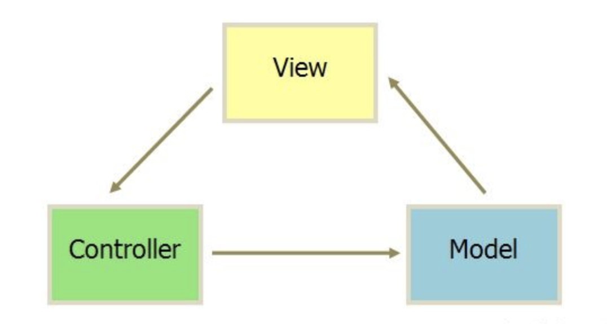
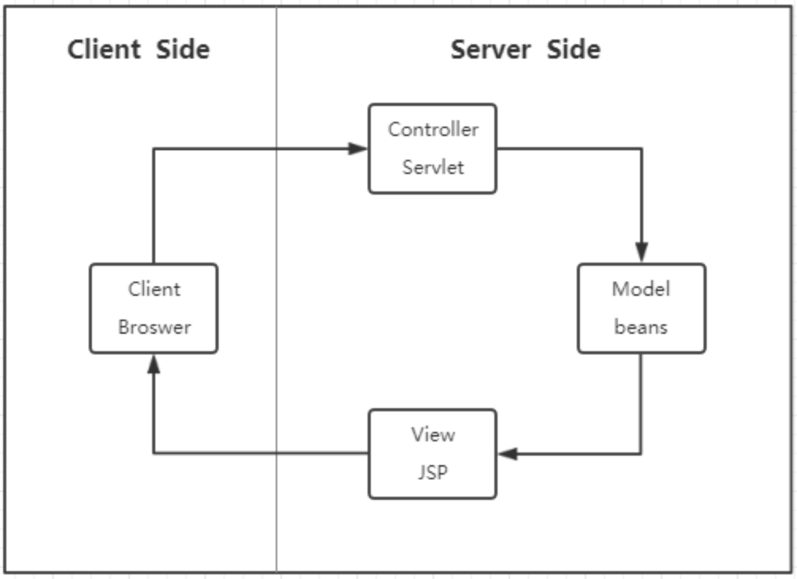
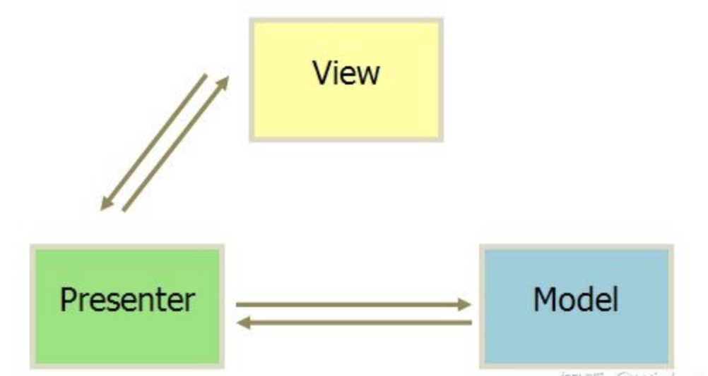
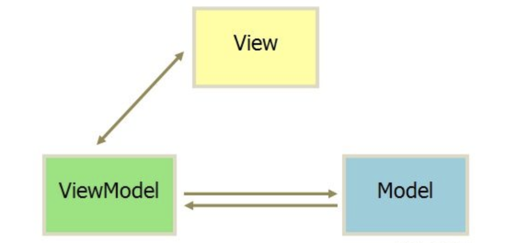
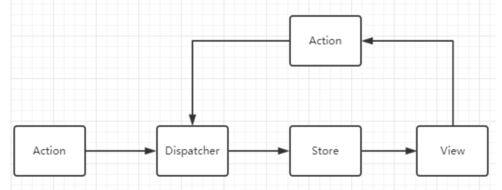

[返回目录](../../README.md)

# MV*设计模式
MVC、MVP、MVVM是前端发展路上经典的设计模式，现在统称为MV*；它们的出现都是为了使系统具有更低的耦合度，更易于维护。

为了弄清楚它们的来龙去脉，需要从前端的发展过程中寻找答案。但是不管是哪种模式，都是为了M和V之间的数据视图同步，只不过同步方式有一些区别。

有一些相同点如下：
- M代表Model层，为数据模型层，存储数据实例以及更新数据实例的方法；
- V表示View层，为视图展示层，将Model中的数据展示出来；

## MVC
C表示Controller层，用于处理各种逻辑，根据用户行为（从V层或者C层本身接受）修改对应M层数据，最终更新C层界面。

它们之间的关系如下：

现在的前端开发中，很少有这种方式，究其出现的原因，要追溯到后端JSP时代；

JSP作为视图展示，Model beans为Model层保持数据对象，Servlet负责处理各种逻辑；这就是最初的MVC，各个层之间耦合度较低，职责比较清晰。

后来随着Ajax出现，前后端开始分离；前端开始使用MVC模式，后端只提供数据接口。

但是这种模式也开始逐渐暴露出一些问题：
- 数据流混乱：大型应用中Model和View之间通常是多对多的关系，因此在修改Model时可能会导致好几个View出现不可预计的修改，维护成本越来越大；
- 厚View轻Controller：越来越多的逻辑写在了View层中，Controller层只作为调用Model接口的工具，变得可有可无；

## MVP
P指的是Presenter，它的作用是调用M和V层的接口，使得数据模型和视图互相更新；关系如下：

它与MVC的区别是，M和V不直接产生关系，只能通过P层沟通。这样就导致职责清晰的同时，M和V功能更加的单一，所有的逻辑关系都有P层去维护；

当然这也会有一定的缺点：
P层会如预计的那般体积变得很大，难以维护。

这种设计之前在Native应用较多，前端用的不多，因为前端框架直接使用了MVVM。

## MVVM
VM指的是View Model，它的作用是绑定V与M层，使它们自动的相互更新；即视图改变，通知VM，VM自动改变Model中的数据，Model改变也通知VM随后自动更新视图；

关系如下：

除了更加的解耦之外，由于V和M都只通知修改VM中的对象，因此V和M是并不知道互相的存在的，这是一个非常松耦合的设计。

目前许多前端框架或库都使用了MVVM或者类MVVM的设计，如Angular、Vue、MobX等；

## Flux、Redux 与 MVC
单向数据流是MVC模式的一个变种，主要解决了数据流混乱的问题。Flux的流程如下：

行为修改数据只能由Action出发，经由Dispatcher修改Store中的数据，紧接着由Store更新界面视图。

在解决了数据流混乱的问题后，这种模式将数据变化变为可控，因此Redux得到了大规模的流行与应用。

## MobX 与 MVVM
MobX是一个实现了MVVM核心的状态管理库。它与配套的工具（如mobx-react）一起实现了完整的MVVM框架。

以在React上的应用为例，一个项目的组成包括MobX、React、mobx-react，其中：
- MobX提供的observable等构成的对象为M层，控制所有数据模型；
- React为V层，实现界面；
- mobx-react即MobX的一些方法为VM层，当数据更新时自动更新视图，并且React可通过MobX的action修改M层的数据。

MobX的实现细节如依赖收集、依赖调用也代表了MVVM的一些实现原理，具体可以参考[此文章](../../framework/mobx/mvvm-in-mobx.md)。

## Angular、Vue、React
在介绍完上面的设计模式后，我们可能会有这样的疑问，常说的前端三大框架究竟是哪种模式？

### Angular
Angular其实不太了解，但是根据网上的[文章](https://cloud.tencent.com/developer/article/1015788)，可以看到它是接近于MVVM的。

### Vue
Vue中包含了MVVM的数据绑定，它部分参考了MVVM，但并没有完全的遵照MVVM去设计。具体可参考[此文章](https://www.zhihu.com/question/327050991);

### React
React其实就是一个实现V层的库。结合各个周边框架，就能遵循不同的设计模式。
- 如果使用redux-react，就是MVC，或者单项数据流。
- 如果使用mobx-react，即实现了MVVM。

但是单独使用React，并没有遵循哪种模式。

## 后记
其实并没有必要纠结具体的哪种模式，前端发展到今天，已经基本不可能遵循各个模式去手写代码了；而且，归根结底，不同的模式殊途同归，都是为了M与V的连接，都是为了数据与视图的独立与解耦。

> 兵无常势，水无常形，因敌变化而取胜者，谓之神。

## 参考资料
- [前端框架模式的变迁](https://github.com/laizimo/zimo-article/issues/28)
- [Angular与MVVM框架](https://cloud.tencent.com/developer/article/1015788)
- [为什么说VUE没有完全遵循MVVM？](https://www.zhihu.com/question/327050991)