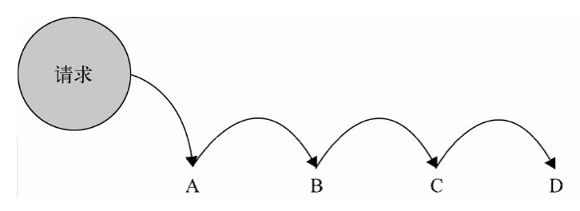

[返回目录](../../README.md)

# JavaScript设计模式
常见JavaScript设计模式如下：

- [单例模式](##单例模式)
- [策略模式](##策略模式)
- [代理模式](##代理模式)
- [迭代器模式](##迭代器模式)
- [发布-订阅模式](##发布-订阅模式)
- [命令模式](##命令模式)
- [组合模式](##组合模式)
- [模板方法模式](##模板方法模式)
- [享元模式](##享元模式)
- [职责链模式](##职责链模式)
- [中介者模式](##中介者模式)

## 单例模式
> 单例模式是指一个类只提供一个供全局访问的实例。

代码演示如下：  
````
// single.js
// 实例对象
class Instance {
    constructor(name) {
        this.name = name;
    }
    getName() {
        return this.name;
    };
}

// 代理实例的工具
let instance = null;
const proxySingle = (name) => {
    if (instance === null) instance = new Instance(name);
    return instance;
};

exports.proxySingle = proxySingle;
````
````
// index.js
const proxySingle = require('./single').proxySingle;

const singleA = proxySingle('A');
const singleB = proxySingle('B');

console.log(singleA === singleB);
console.log(singleB.getName() === 'A');
````

使用场景：只需要存在一个实例的对象或者组件，如模态框，全局对象等等。

## 策略模式
> 策略模式是指定义一系列算法，封装不同处理逻辑，并且他们可以相互替换。将算法的实现和算法的使用隔离开来。

### 例子1：奖金计算
年终奖等级有'S', 'A', 'B', 'C'四种，分别对应的奖金策略为：
- 'S'：三倍工资，并且额外+1w
- 'A'：两倍工资，额外+5k
- 'B'：一倍工资，+1k
- 'C'：一倍工资，-2k

根据每个员工工资乘以系数则为年终奖。

原实现：
````
(() => {
    const calculate = (level, salary) => {
        let bonus = 0;
        if (level === 'S') {
            bonus = calculateS(salary);
        } else if (level === 'A') {
            bonus = calculateA(salary);
        } else if (level === 'B') {
            bonus = calculateB(salary);
        } else { // 如果有新的等级'D'，需要破坏这里的代码
            bonus = calculateC(salary);
        }
        return bonus;
    }
    // 实际情况的计算逻辑可能比这复杂很多，因此大部分情况下会提取计算逻辑为单独函数
    const calculateS = (salary) => salary * 3 + 10000;
    const calculateA = (salary) => salary * 2 + 5000;
    const calculateB = (salary) => salary * 1 + 1000;
    const calculateC = (salary) => salary * 1 - 2000;
    console.log(calculate('S', 1000));
    console.log(calculate('A', 2000));
})();
````
使用JavaScript实现策略模式：
````
(() => {
    const strategy = {
        'S': (salary) => salary * 3 + 10000,
        'A': (salary) => salary * 2 + 5000,
        'B': (salary) => salary * 1 + 1000,
        'C': (salary) => salary * 1 - 2000
    };
    const calculate = (level, salary) => strategy[level](salary);

    console.log(calculate('S', 1000));
    console.log(calculate('A', 2000));
})();
````
这个例子中，新增年终奖等级即在strategy对象新增策略即可。

### 例子2：表单校验
再看一个表单校验的例子，需求如下：
表单有三种验证，
- 名字不为空
- 密码长度不小于6位
- 手机号为数字

对于表单1，检验名字和密码；对于表单2，检验名字、密码和手机号。

原实现：
````
(() => {
    const validate = (data1, data2) => {
        const checkName = (value) => value !== '';
        const checkPassword = (value) => value.length >= 6;
        const checkPhone = (value) => /(^1[3|5|8][0-9]{9}$)/.test(value);

        const result1 = checkName(data1.name) && checkPassword(data1.password);
        const result2 = checkName(data2.name) && checkPassword(data2.password) && checkPhone(data2.phone);
        return result1 && result2;
    }

    console.log(validate(
        { name: 'zhang', password: '123', phone: '13333333333' },
        { name: 'liu', password: '123456', phone: '13333333333' },
    ));
})();
````
使用JavaScript实现策略模式：
````
(() => {
    const validator = {
        name: (value) => value !== '',
        password: (value) => value.length >= 6,
        phone: (value) => /(^1[3|5|8][0-9]{9}$)/.test(value)
    };
    class Context {
        constructor(rules) { this.setRules(rules); }
        setRules(rules) { this.rules = rules; }
        doRules(data) { return this.rules.every(rule => validator[rule](data[rule])); }
    }

    const validate = (data1, data2) => {
        const context = new Context([]);
        context.setRules(['name', 'password']);
        const result1 = context.doRules(data1);
        
        context.setRules(['name', 'password', 'phone']);
        const result2 = context.doRules(data1);
        return result1 && result2;
    }

    console.log(validate(
        { name: 'zhang', password: '123', phone: '13333333333' },
        { name: 'liu', password: '123456', phone: '13333333333' },
    ));
})();
````
在这个例子中，
- 对于表单校验的每个子项，定义了一组校验策略；  
- 提供一个Context对象解析规则，唯一的调用这些策略；  
- 外部只能通过Context对象，传入对应的配置，去使用这些策略；
- Context对象可由函数代替。

这样的好处显而易见：
- 校验规则的增加只需要在策略对象validator中增加一条策略；
- 修改原有校验逻辑只需要修改配置即可；
- 符合开放封闭原则；
  
缺点也很明显：
- 增加了样板代码的复杂度：这个可以通过将Context对象改为函数解决，并不一定需要持有策略规则，只需要提供一个访问策略的入口；

总结：
1. 使用哪个策略，在以class为主的语言(如Java)，通常使用工厂模式和反射消除if else；在JavaScript中，可以简单的使用对象自变量解决；
2. 单独使用策略模式并不是为了消除if else，更多的是为了封装一组可替换的策略，降低耦合度；策略的增加不影响原有策略，修改原有校验逻辑只需要修改配置。因此策略模式通常和配置结合。
3. 在JavaScript这种函数为一等公民的语言中，不必要执着于用类实现策略模式，只要注意将算法的定义和算法的使用分开即可；
4. 使用场景为：需要封装一系列业务规则，例如表单校验、动画类型等等；

## 代理模式
> 代理模式是在不破坏目标对象的完整性的情况下为其提供额外功能的模式；

代理对象和被代理对象一般具有相同的接口；以便于外部切换对于代理对象和被代理对象的引用。

这样会带来两个好处：
- 被代理对象符合单一职责原则；
- 代理对象与被代理对象符合开放封闭原则；

JavaScript中广泛使用的有虚拟代理和缓存代理。

### 虚拟代理
在对象操作开销较大时，在使用对象之前才创建，而不是一开始就创建。

接下来看一个合并Http请求的例子，通过代理模式，将原来每500ms发送一次Http请求变为每2s合并发送一次，降低了网络消耗。

从代码层面上来看，代理模式不破坏原对象，使得发送Http请求的对象职责单一，且若未来不需要考虑网络消耗，直接将代理对象的引用改为原对象的引用，符合开放闭合原则。
````
// 模拟发送http请求
const sendHttp = (message) => console.log(`send ${message}`);

// 代理sendHttp，合并发送http请求
const proxySendHttp = (() => {
    let caches = [];
    setInterval(() => {
        sendHttp(caches.join(', '));
        caches = [];
    }, 2000);
    return (message) => {
        caches.push(message);
    };
})();

const send = () => {
    let i = 0;
    setInterval(() => {
        i++;
        sendHttp(`sync ${i}`);
        proxySendHttp(`async ${i}`);
    }, 500);
};
send();

/** 输出：
send sync 1
send sync 2
send sync 3
send async 1, async 2, async 3
send sync 4
send sync 5
send sync 6
send sync 7
send async 4, async 5, async 6, async 7
**/
````
其他使用场景下如lazyRequire也可以使用。

### 缓存代理
缓存代理则是为开销大的计算提供缓存的代理模式。

````
const computeProduct = (numList) => {
    console.log(`computing... ...`);
    return numList.reduce((s, c) => s * c, 1);
};

// 缓存代理计算
const proxyComputeProduct = (() => {
    const caches = {};
    return (numList) => {
        const key = numList.join('|');
        if (caches[key] === undefined) {
            caches[key] = computeProduct(numList);
        }
        return caches[key];
    };
})();

console.log(proxyComputeProduct([1, 2, 3, 4]));
console.log(proxyComputeProduct([1, 2, 3, 4]));

/** 输出：
computing... ...
24
24
**/
````
另外的使用场景有Http数据缓存、加载图片缓存等等。

## 迭代器模式
> 迭代器模式是指提供一种方法顺序访问一个聚合对象中的各个元素，而又不需要暴露该对象的内部表示。

迭代器模式是最为常见的模式，几乎所有的编程语言都支持了该模式，在JavaScript中更是广泛使用，值得注意的是，循环(for/while)不是迭代器模式。

迭代器模式分为内部迭代器和外部迭代器两种。

### 内部迭代器
常见的forEach，map都是这种内部迭代器。它的特点是完全控制了迭代的规则，外部只需要一次调用即可。

这样的好处是调用简单，但是不够灵活，比如同时遍历两个数组，就不能简单地使用内部迭代器。

### 外部迭代器
外部迭代器是控制了一些api，供外部程序自己控制迭代规则的模式。与内部迭代器相反，它足够灵活，但是调用起来也相对繁琐。

一般地，提供的api有:
- next: 当前指针指向下一个对象；
- isDone: 是否已遍历完；
- getCurrentItem: 获取当前的元素。

## 发布-订阅模式
> 发布-订阅模式又叫观察者模式，它保持一对多的依赖关系，当被依赖者的状态发生改变时，会通知所有依赖者。

发布订阅模式在JavaScript事件中广泛使用，比如Dom相应事件、React Native Event等等。在一些设计模式（MVVM等）上也有应用。它主要解决了两个问题：
- 时间上的解耦：依赖方不需要了解被依赖方内部状态点，只需要订阅关注时间点；
- 对象间的解耦：使用通用方式通知依赖方，不需要显示调用，取代硬编码的调用代码。

接下来看一个简单的例子：
````
// 定义通用的event.js
const Event = {
    subscribers: {},
    addEvent: function (key, callback) {
        if (this.subscribers[key] === undefined) {
            this.subscribers[key] = [];
        }
        this.subscribers[key].push(callback);
    },
    sendEvent: function (key, data) {
        const cbs = this.subscribers[key];
        if (cbs && cbs.length > 0) {
            cbs.forEach(cb => cb(data));
        }
    },
    removeEvent: function (key) {
        this.subscribers[key] = [];
    }
};

exports.Event = Event;
````
````
const Event = require('./event').Event;

const KEY = 'LOG';

// 设置两个订阅者
Event.addEvent(KEY, (data) => console.log(`get ${data}`));
Event.addEvent(KEY, (data) => console.log('event fired'));

setTimeout(() => {
    Event.sendEvent(KEY, 'Hello');
}, 500);


/** 输出
get Hello
event fired
**/
````

值得注意的是，发布-订阅模式虽然解决了耦合问题，但是过度使用就会导致模块间必要的依赖关系的淡化，这对于维护上是非常不利的。每一个订阅关系的增加就代表着显示依赖关系的缺少。

## 命令模式
命令模式主要为了消除请求发送者与请求接收者之间的耦合关系，发送者与接收者不需要关心具体对方是怎么处理命令的。

通常只需要定义好具体可用命令，后面可以方便的切换接受者；在JavaScript中，侧重点在于这种解耦合的思想，命令模式通常是隐形的。

## 组合模式
组合模式的表现形式类似于树，主要为了消除调用者与每一个叶对象的耦合，调用者不需要通知到每一个叶对象，而是通过组合对象进行分发。

通常，组合对象与叶对象拥有相同的接口，一组叶对象之间也需要有相同的接口，这样才能保持操作的一致性。

使用场景为：
- 遍历树
- 遍历文件夹

应当注意的是，在叶对象具体重复的组合关系时，不适用这种模式，可能会导致相同的叶对象的重复调用。

## 模板方法模式
模板方法模式是将一些通用的行为与具体的行为内容解耦的模式。一般的，在抽象类中定义一些方法的执行步骤，由各个子类的实例去实现相同方法的不同内容，从而达到隔离变化的目的。

以泡茶和泡咖啡举例，两者都需要经历 烧水 -- 放咖啡/茶叶 -- 搅拌 -- 放其他调料 的步骤。

在抽象类中，定义好一个描述上述行为（四个步骤的先后调用），并且调用各个步骤的方法。每个步骤具体的内容由子类去决定放哪种材料。

以React框架为例，每个Class Component都继承与React.Component，且每个Component都要实现React定义的一些生命周期，用以控制自身的行为。

React.Component中，调用这些生命周期的方法和这些生命周期的方法就使用了模板方法模式。在前端框架中，这种模式很常见。

当然，在JavaScript中，并不一定要使用继承去实现，也可以通过高阶函数实现。

## 享元模式
享元模式是为了解决性能问题而产生的，在需要生成大量类似的对象可能造成内存大量使用时，可以通过剥离相同状态和差异状态，节省对象的创建数量，从而达到优化性能的目的。

一般将对象的属性分为内部状态和外部状态，内部状态是共享的，通常不会根据场景变化；外部状态一般是差异化的，跟随各个对象实例。

## 职责链模式
职责链模式是指请求在一组处理者中线性传递，直到遇到一个可以处理它的对象。

职责链最大优点就是解耦了请求发送者和 N 个接收者之间的复杂关系，由于不知道链中的哪个节点可以处理你发出的请求，所以你只需把请求传递给第一个节点即可。另外，与链表类似，在修改时可以自由的添加删除节点，而不需要破坏原有代码。

常见的原型链、作用域链、事件冒泡，都是职责链模式的应用。

## 中介者模式

## 参考
- [《JavaScript设计模式与开发实践》](http://product.dangdang.com/23698327.html)
- [策略模式](https://www.cnblogs.com/jiujiduilie/p/9191629.html)
