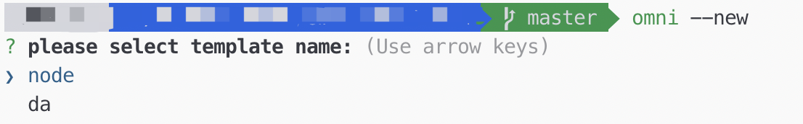

[返回目录](../../README.md)

# 如何创建一个脚手架工具(CLI)
CLI全称为command line interface。过年在家闲着没事，终于把以前的坑给填了。  
做了一个万能模板脚手架工具[omnipotent-cli](https://www.npmjs.com/package/omnipotent-cli)，可以根据任何模板创建新项目。  
开发过程中，遇到了一些问题，例如：
- [如何创建命令？](##如何创建命令)
- [如何与用户交互？](##如何与用户交互)
- [如何本地测试？](##如何本地测试)
- [如何配置命令？](##如何配置命令)
- [如何publish至npm？](##如何publish至npm)
- [如何在push时自动publish？](##如何在push时自动publish)

接下来会一一对这些问题进行解答。

## 如何创建命令？
> [commander](https://github.com/tj/commander.js/blob/HEAD/Readme_zh-CN.md)是node.js命令行接口的完整解决方案。

在设计命令时，因为本身需要增加的命令不多，因此全部使用option的方式，即：
````
Usage: omni [options]

Options:
  -V, --version  output the version number
  -a, --add      add new template
  -n, --new      new project by template
  -l, --list     list all templates
  -d, --delete   delete a template
  -h, --help     output usage information
````

## 如何与用户交互？
设计好命令之后，接下来就是与用户进行交互了，这也是整个命令行工具的最重要的一环。  
在设计CLI时主要以方便用户输入为主，考虑下面两个维度：
- 选择大于输入
- 问答大于命令

例如：git commit -m 'test'，就需要用户记住参数的格式，个人不太喜欢这种模式。  
所以，交互设计成问答式的，使用[inquirer](https://www.npmjs.com/package/inquirer)即可。  
参考如下：



对应配置如下：
````
inquirer.prompt([
    {
        type: 'list',
        name: 'name',
        message: 'please select template name:',
        ['node', 'da']
    }
])
````
inquirer会将所有对话中用户的输入返回以供系统处理，具体请参考官方文档。

## 如何本地测试？
设置命令的js文件头部需要增加
````
#!/usr/bin/env node
````
以告诉命令行工具使用node环境执行。  
本地测试时可在scripts中增加一条命令：
````
"help": "chmod 775 ./bin/cli.js && ./bin/cli.js --help"
````
值得注意的是未修改js文件的权限可能会报permission error。

## 如何配置命令？
这一步是为了在全局安装CLI后，将CLI绑定到命令行。  
例如，在命令行中，输入：
````
> omni --help
````
系统会搜寻全局npm中匹配omni的文件执行。  
在项目的package.json中配置如下：
````
"bin": {
    "omni": "./bin/cli.js"
}
````

在publish之前，可在本地系统进行测试，在根目录下执行
````
npm link
````
即可将该命令绑定到系统，可在本地测试。

## 如何publish至npm？
- 在[npm](https://www.npmjs.com/)注册npm账户；
- 在项目根目录中输入 npm login，登录npm账户；
- 切换本地npm源为官方npm源；
- 执行npm publish；

可能会遇到的问题：
- 403 Forbidden：npm已经有同名package存在，修改package.json中项目名即可；

## 如何在push时自动publish？
使用[github action](https://help.github.com/en/actions)完成自动publish功能。
参考[此文章](https://sergiodxa.com/articles/github-actions-npm-publish/)有详细步骤。  
主要有下面几步：
- 在npm对应的package中新建token；
- 复制token，在github项目中添加Secrets；
- 项目根目录下新建 .github/workflows/main.yml，编辑action；

即可。
可以参考的action如下：
````
name: Publish

on:
  push

jobs:
  build:
    runs-on: ubuntu-latest
    steps:
      - uses: actions/checkout@v1
      - uses: actions/setup-node@v1
        with:
          node-version: 12
          registry-url: https://registry.npmjs.org/
      - run: yarn install
      - run: npm publish --access public
        env:
          NODE_AUTH_TOKEN: ${{secrets.NPM_TOKEN}}

````

至此，即完整地创建了一个CLI工具。

## 参考
- [cli 工具开发](https://www.infoq.cn/article/vJMUkzzFAvgffp12MIpy)
- [Automatically Publish to npm using GitHub Actions](https://sergiodxa.com/articles/github-actions-npm-publish/)