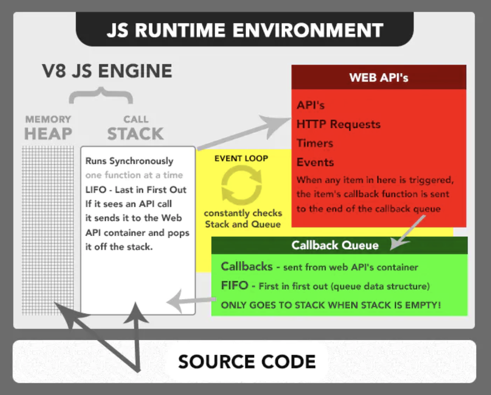
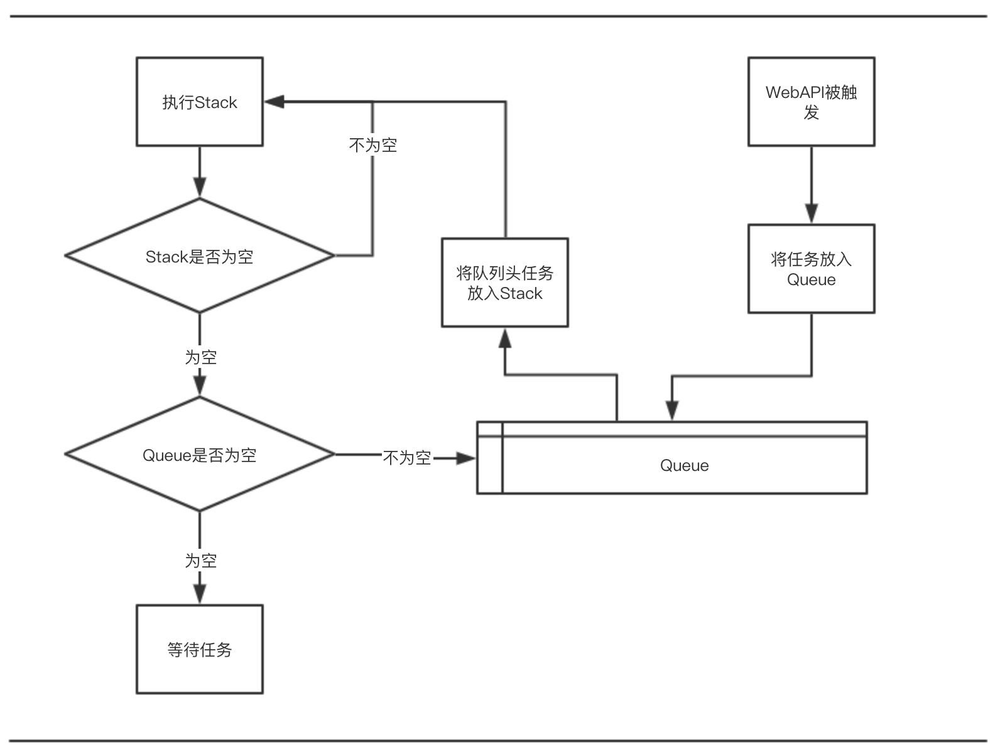

[返回目录](../../README.md)

# JavaScript并发模型与事件循环
JavaScript并发模型基于事件循环，即常说的Event Loop。
JavaScript是单线程语言，执行机制和C、Java这些语言完全不同。

## 运行时模型
JavaScript运行时模型如下：



### Heap
存放的是对象实例，对应的是一大块内存区域；

### Stack
保存函数执行时的上下文状态；
````
function foo(b) {
  return b + 11;
}

function bar(x) {
  return foo(x * 3);
}

console.log(bar(7)); // 返回 42
````
在执行console.log时，bar和foo先后入栈，并且包含运行时的上下文，执行顺序和入栈顺序相反，执行完成后清空Stack。

每次执行函数时JavaScript都会将函数推入栈顶，当执行完成后出栈，并且将下一个函数入栈。

## Web API
Stack中的Web API的调用会分发到此，包括Event监听函数、HTTP请求、定时器函数等等。当它们被触发后，就会将相应的处理任务推入Queue中。

## Queue
> 一个JavaScript运行时包含了一个待处理的消息队列。每一个消息都关联着一个用以处理这个消息的函数。

在JavaScript运行时，异步的任务都会添加进这个队列中，当Stack为空时，从队列头取出任务执行，执行后从队列中删除此任务，接着执行下一个任务。

每个任务执行时，都会一直占用执行直到Stack为空。

## Event Loop
事件循环是指在JavaScript运行中，会持续检查Stack中是否为空，不为空则继续执行，为空则检查Queue中是否还有任务未处理，若有，则从队列头中取出任务执行。同时，Web API中若有API被触发，也会将任务送入队列尾。

完整的流程如下：


在Event Loop中，异步任务分为两类，宏任务与微任务：

- 宏任务包括 setTimeout、setInterval、script（整体代码）、 I/O 操作、UI 渲染等；

- 微任务包括 Promise，process.nextTick(仅Node)；

一般地，执行顺序优先级为同步任务 > 微任务 > 宏任务；

简单的例子如下：

````
const log = console.log;
setTimeout(() => log(1));
process.nextTick(() => log(2));
Promise.resolve().then(() => log(3));
console.log(4);

// 4,2,3,1
````

对于多层嵌套的任务，如宏任务嵌套宏任务等等；大体上还是按照 同步任务 > 微任务 > 宏任务 的这个顺序；

但是浏览器执行环境和Node执行环境对微任务的优先级处理却有一些差别，接下来我们针对几个例子分别讨论这两个环境上的执行情况。

### 宏任务嵌套宏任务
````
setTimeout(() => {
    console.log(1);
    setTimeout(() => console.log(2), 0);
},         0);

setTimeout(() => {
    console.log(3);
    setTimeout(() => console.log(4), 0);
},         0);
````
浏览器环境和Node环境均输出1，3，2，4；

### 宏任务嵌套微任务
````
setTimeout(() => {
    console.log(1);
    Promise.resolve().then(() => console.log(2));
},         0);

setTimeout(() => {
    console.log(3);
    Promise.resolve().then(() => console.log(4));
},         0);
````
Node环境：1，3，2，4；
浏览器环境：1，2，3，4；

### 微任务嵌套宏任务
````
Promise.resolve().then(() => {
    console.log(1);
    setTimeout(() => console.log(2));
});

Promise.resolve().then(() => {
    console.log(3);
    setTimeout(() => console.log(4));
});
````
浏览器环境和Node环境均输出1，3，2，4；

### 微任务嵌套微任务
````
Promise.resolve().then(() => {
    console.log(1);
    Promise.resolve().then(() => console.log(2));
});

Promise.resolve().then(() => {
    console.log(3);
    Promise.resolve().then(() => console.log(4));
});
````
浏览器环境和Node环境均输出1，3，2，4；

可以看到，只有 宏任务嵌套微任务 时，浏览器环境和Node环境运行情况不一致。

究其原因，是因为队列Queue中分为两个队列，宏任务队列和微任务队列，宏任务队列是一个一个地执行，微任务队列是一批一批地全部执行，而两个环境上执行顺序有细微差别，体现在：

- Node环境是在 <b>所有</b> 宏任务执行完后执行微任务队列；
- 浏览器环境是在 <b>单个</b> 宏任务执行完后执行微任务队列；

所以在宏任务嵌套微任务时才会出现不一致的情况。

不过，在Node 11中，调整了这个顺序，保持与浏览器执行环境一致，即：

都是在 <b>单个</b> 宏任务执行完后执行微任务队列；

## 总结
- JavaScript运行时分为Stack、Heap、Web API、Queue；
- 宏任务包括 setTimeout、setInterval、script（整体代码）、 I/O 操作、UI 渲染等；
- 微任务包括 Promise，process.nextTick(仅Node)；
- 同步任务 > 微任务 > 宏任务；
- 现在Node环境与浏览器环境队列任务嵌套时执行顺序有细微差别，在Node 11上统一为在单个宏任务执行完后执行微任务队列；

## 参考
- [并发模型与事件循环](https://developer.mozilla.org/zh-CN/docs/Web/JavaScript/EventLoop)
- [JS运行时环境](https://juejin.im/post/5c7be69e51882555a8223325)
- [JavaScript 执行机制](https://juejin.im/post/59e85eebf265da430d571f89)
- [浏览器与Node的事件循环(Event Loop)有何区别?](https://juejin.im/post/5c337ae06fb9a049bc4cd218#heading-11)