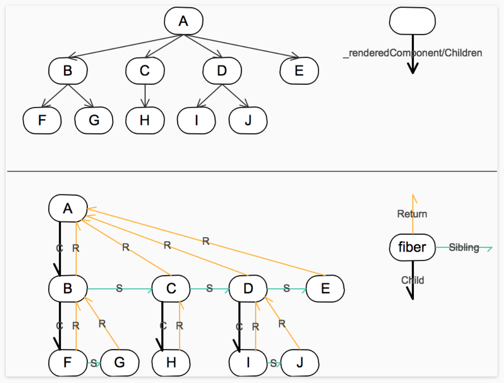

# react fiber
## react fiber是什么
react fiber是react在16版本后采用的一种新的架构，完全重写了其核心算法，用以解决在渲染过程中遇到的性能问题。

## 解决了什么问题
1. 解决了react reconciliation过程中JS长时间运行，可能导致的界面卡顿、动画掉帧、交互缓慢的问题。
> 因为JavaScript在浏览器的主线程上运行，恰好与样式计算、布局以及许多情况下的绘制一起运行。如果JavaScript运行时间过长，就会阻塞这些其他工作，可能导致掉帧。
2. 组件不能直接返回数组的问题。

## 如何实现
### 算法由栈的递归调用改为链表结构的循环执行
1. 将原来的vdom对象升级为fiber对象，在更新diff过程中，将任务分解成一些小任务，每次执行任务前检查浏览器分配的剩余可执行时间，时间不够时不执行，将控制权上交，记录当前fiber节点，等待下一个时间片来临再执行；
2. 扩展的fiber节点对象，增加了一系列属性指针，return、child、sibling，分别指向父节点、子节点、右边兄弟节点；这样就保证了链表结构的循环遍历；

### Fiber reconcile过程
1. reconcile过程分为两个阶段：
- render/dom diff: 可暂停、恢复，得到diff之后的virtual dom差异结果；
- commit change: 不可中断，更新diff的结果到真实的dom。
2. render/dom diff过程：
> 以fiber tree为参照，生成work progress tree，完成后直接替换原来的fiber tree
- a. 如果当前节点不需要更新（更新过了，从child返回），跳到e；需要更新则打个tag，用于中断后恢复用；
- b. 更新当前节点props、state、context；
- c. 判断shouldComponentUpdate，如果是false，跳到e；
- d. 调用render()，将当前节点的diff结果放到effect list；参考之前的child fiber生成新的child fiber；
- e. 如果没有child fiber，将effect list归并到return，并将sibling fiber作为下一个节点；否则将child fiber作为下一个节点；
- f. 检查剩余可执行时间，时间充足则回到a更新下一个节点；否则记录当前节点，等待下一个时间片的分配再执行；
- g. 如果最终回到了根节点，则work progress tree完成，此过程结束。
3. commit change过程：
> 此阶段不能暂停，处理根节点上的effect list，包含所有diff的结果
- 更新dom；
- 调用render后的生命周期（componentDidMount、componentDidUpdate、componentWillUnmount）；
- 更新ref。

## 与之前的架构的比较

- stack reconciler不能中断，fiber reconciler可中断恢复
- 节点遍历递归改为循环

## 参考
- [完全理解React Fiber](http://www.ayqy.net/blog/dive-into-react-fiber/)
- [React Fiber架构(司徒正美)](https://zhuanlan.zhihu.com/p/37095662)
- [React16源码之React Fiber架构](https://juejin.im/post/5b7016606fb9a0099406f8de)