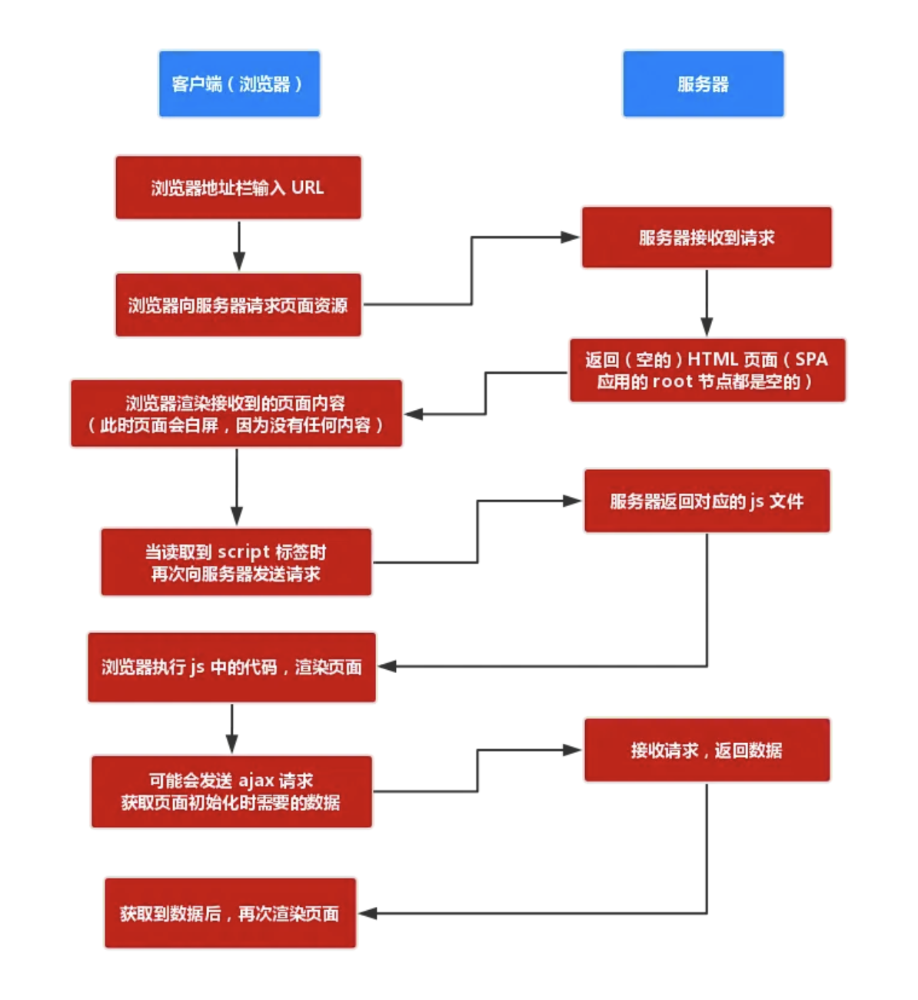
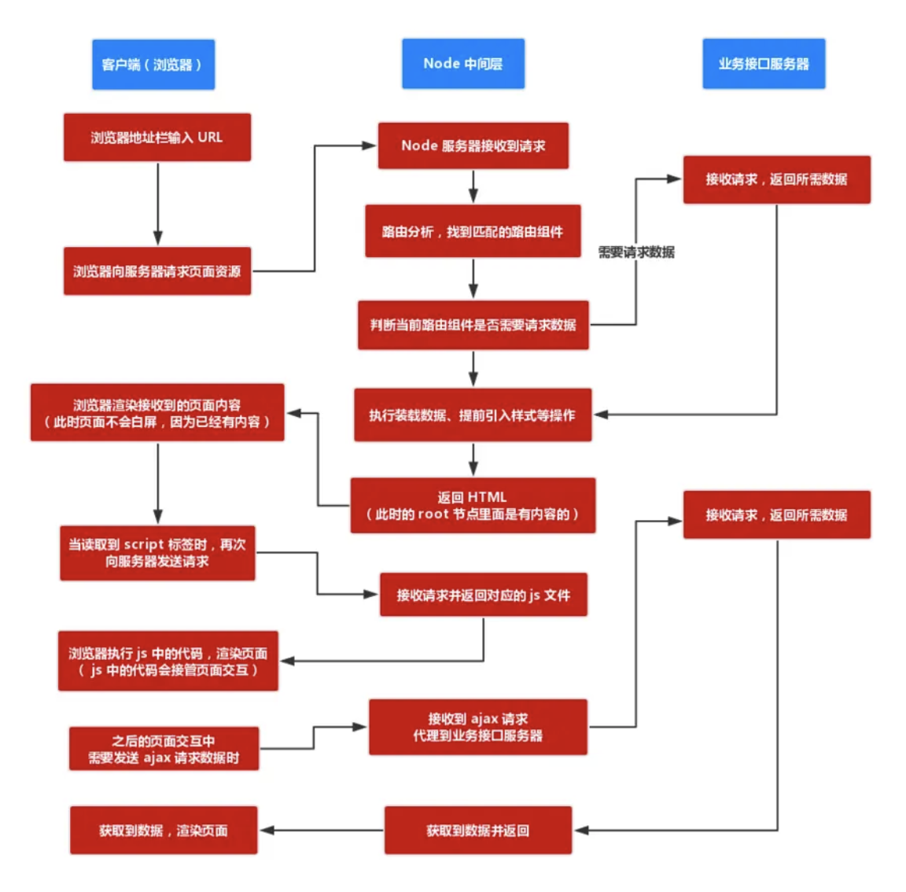
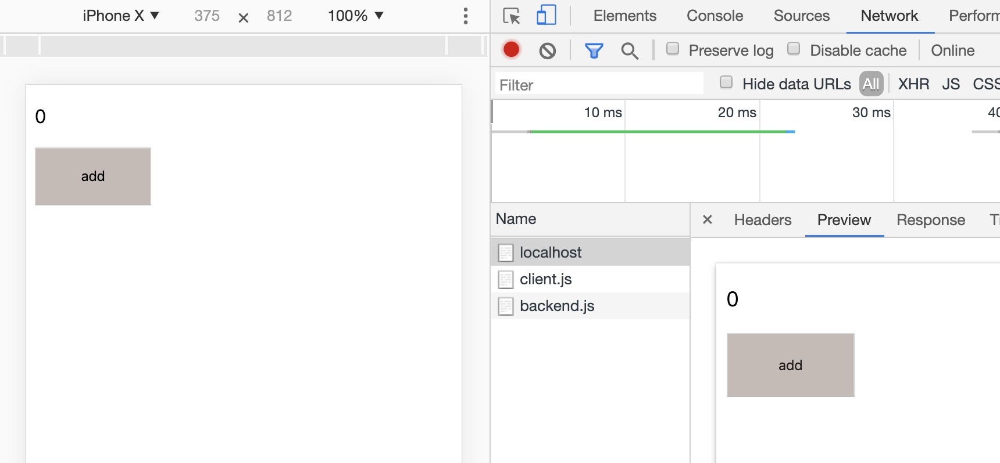

[返回目录](../../README.md)

# React同构渲染
## 同构渲染是什么
- 同构渲染是指一套代码既在客户端运行，又在服务端运行。理想情况下，客户端在收到服务端渲染出来的html后，判断是否需要进一步渲染，并且后续的事件绑定由浏览器进行；
## 为什么要做同构渲染
1. 解决首屏白屏问题；

客户端渲染流程如下：

页面白屏是因为在加载空html后，需要从服务器加载js文件，且需要执行js渲染页面，这部分时间用户看到的界面是白屏的。

服务端渲染流程如下：

可以看到，浏览器首次请求即获取到带有内容的html，不会白屏。

2. 更好的SEO；

搜索引擎爬虫会抓取首次请求的页面内容，在客户端渲染流程中，抓取的内容为空，搜索引擎就不能分析网站内容，进而无法排名；而在服务端渲染时，爬虫可抓取到内容，则对搜索引擎更友好。

## 同构渲染必要条件
1. 前端和服务端具有相同的JavaScript运行环境，可执行同一套代码；
2. 得益于Virtual Dom的存在，若在node中有dom操作时，可操作虚拟dom，然后输出到浏览器即可。

## React同构示例
完整代码：[github](https://github.com/Lskkkk/Demo/tree/master/react-ssr-demo)

### 基本服务端渲染
先构造一个React App，为一个简单的计数应用；
````
import * as React from 'react';

class App extends React.Component {
  constructor() {
    super();
    this.state = { count: 0 };
    this.addCount = this.addCount.bind(this);
    console.log('constructor!!!!!!!');
  }
  componentDidMount() {
    console.log('componentDidMount!!!!!!!');
  }
  render() {
    console.log('render!!!!!!!');
    return (
      <div id="app">
        <p>{this.state.count}</p>
        <button onClick={this.addCount} style={{ width: 100, height: 50, backgroundColor: '#5325' }}>add</button>
      </div>
    );
  }
  addCount() {
    this.setState((state) => ({ count: state.count + 1 }));
  }
}

export default App;
````

接着使用koa搭建一个服务，在请求进来时，读取html内容，并将<App/>渲染成字符串，填充到html中并返回给请求；
````
import Koa from 'koa';
import Router from 'koa-router';
import fs from 'fs';
import path from 'path';

import * as React from 'react';
import { renderToString } from 'react-dom/server';

import App from '../app/app';

const PORT = 3000;
const server = new Koa();
const router = new Router();

router.get('/', (ctx) => {
    const html = fs.readFileSync(path.resolve(__dirname, '../../public/page.html'), { encoding: 'utf-8' });
    const page = html.replace('APP_CONTENT', renderToString(<App/>));
    ctx.body = page;
});

// 静态资源导出，页面打包的js和html
server.use(require('koa-static')(path.join(__dirname, '../../public')));
server.use(router.routes());

server.listen(PORT, () => console.log(`listening on ${PORT}`));
````

启动server，这样就直接访问页面：

可以看到，请求服务端时直接返回的是已经渲染好的html页面；

### 事件绑定
但是现在还有一个问题，点击add并没有响应，因为事件绑定只能在前端直接绑定Dom，因此需要继续在前端执行剩下的事件绑定。

首先创建client.js渲染入口，
````
import React from 'react';
import ReactDOM from 'react-dom';
import App from './app';

ReactDOM.hydrate(<App />, document.getElementById('root'));
````
使用hydrate可以尽可能的复用Dom结构；节省资源。

接着配置好webpack及静态目录，然后在html中引入client.js文件,
````
<script src="./client.js"></script>
````
重启项目并访问页面，即能够成功执行事件。

## hydrate
> hydrate是 React 中提供在初次渲染的时候，去复用原本已经存在的 DOM 节点，减少重新生成节点以及删除原本 DOM 节点的开销，来加速初次渲染的功能。主要使用场景是服务端渲染或者像prerender等情况。

是否执行hydrate，取决于下面任一条件：
1. 主动调用ReactDOM.hydrate；
2. 即使使用了ReactDOM.render，React也会判断是否组件是否是普通的element并且具有data-reactroot(服务端渲染时添加)的属性；

## 注意事项
- 服务端渲染只会执行首次渲染，即constructor - getDerivedStateFromProps - render，因此如果有网络请求不要放在这几个生命周期中，以免造成内存泄漏；

## Next.js
> [Next.js](https://nextjs.frontendx.cn/) 是一个轻量级的 React 服务端渲染应用框架。

## 参考
- [React SSR 详解](https://juejin.im/post/5def0816f265da33aa6aa7fe)
- [react-ssr 代码示例](https://www.okcode.net/article/607)
- [hydrate](https://react.jokcy.me/book/features/hydrate.html)
- [Next.js](https://nextjs.frontendx.cn/docs/#%E5%AE%89%E8%A3%85)