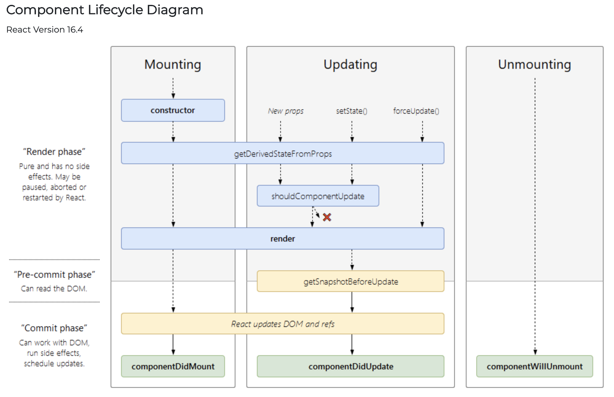

[返回目录](../../README.md)
# React新的生命周期
## 疑问
- 废弃了哪些，新增了哪些？
- 为什么要采用新的生命周期？
- 使用上要注意哪些问题？

## 增删情况
废弃的生命周期有：
- componentWillMount
- componentWillReceiveProps
- componentWillUpdate

新增了两个：
- static getDerivedStateFromProps
- getSnapshotBeforeUpdate

## 为什么要采用新的生命周期
以前的生命周期流程上很完整，本身没啥问题，但是在以后的发展中，React会采用异步渲染、时间分片等机制(Fiber架构)，会导致render前的生命周期可能会多次调用，就会存在许多使用上的问题：
- componentWillMount：许多用户喜欢将请求数据放在这个时间段操作，此钩子函数会多次调用，这种场景下会造成IO和内存的浪费；
- componentWillReceiveProps：比如传入的props中某些参数改变了，用户喜欢在这个生命周期中重新请求数据，还是因为多次调用可能会产生问题；
- componentWillUpdate：一般会配合componentDidUpdate使用，但是采用异步渲染和时间分片等机制后，可能会导致这两个周期间隔太长时间执行，足够用户通过交互修改Dom，导致不能预测的bug。
  
新的生命周期如何解决这些问题的呢？
- static getDerivedStateFromProps：static方法，避免用户直接获取到组件实例，有两个好处：
    1. 限制用户之前在componentWillReceiveProps中直接请求数据的行为；
    2. 只允许通过props更新state，限制越多，api就越明确，错误就越少。
- getSnapshotBeforeUpdate：
    1. 执行时间上比componentWillUpdate更晚，在Dom即将改变之前；
    2. 新的api的执行结果会作为第三个参数传入componentDidUpdate，更节省内存。

更新后的生命周期流程图如下：

# 使用时应该注意的问题
- getDerivedStateFromProps中不能访问当前组件实例，若需要请求数据，在componentDidUpdate中请求；
