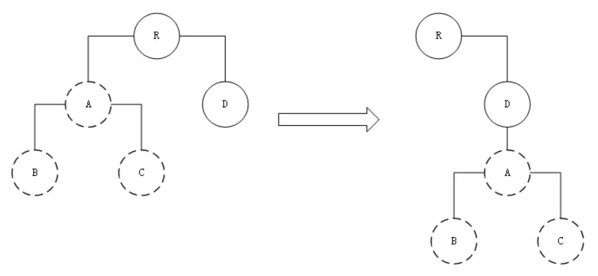
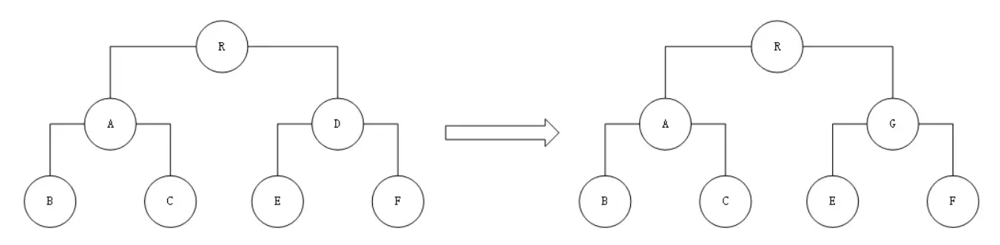

# React Virtual Dom与Dom Diff算法
## Virtual Dom
### 为什么采用virtual dom
- dom操作昂贵，在大部分没有专门优化dom操作的场景下，virtual dom集中更新dom比直接操作dom效率高
- 抽象了原本的渲染过程，实现了跨平台的能力（各种移动端、服务端）

### 结构
Virtual Dom对象一般包含三个属性，
````
{
    type, // html标签类型，或者rn中的组件类型等等
    props, // 组件接收的props，包括class、style等等都是
    children // 子组件，也会生成virtual dom对象
}
````
这样就从根节点生成了Virtual Dom Tree，后续的diff和path都在这棵树上操作。

## Dom Diff
### 从O(n^3)到O(n)
Dom Diff算法不是React团队首创，传统的Dom Diff算法，经过各个大佬的不懈努力，最终复杂度提升到了O(n^3)；  
之前的算法解决的是两棵树最短编辑距离(Tree Edit Distance)的问题，即如何找出将一棵树修改为任意另一棵树的最小步数；  

React团队针对实际情况进行优化，做了一些限制，将diff算法从O(n^3)缩短到O(n)，性能产生了巨大的提升；  
React中前后diff的Virtual Dom Tree大部分情况下结构是非常相似的，因此做了如下策略上的优化：
- Tree Diff：UI中DOM节点跨层级的移动操作特别少，可以忽略不计。
- Component Diff：拥有相同类的两个组件将会生成相似的树形结构，拥有不同类的两个组件将会生成不同的树形结构。
- Element Diff：对于同一层级的一组子节点，它们可以通过唯一id进行区分。

### 详细
#### Tree Diff

- 当遇到Dom节点跨层级移动的操作时，Diff时不会将不同层级的节点进行比对；  
- 当发现某个层级的节点被移到另一层级时，则删除当前节点，同时在另一层级重新生成移动的节点；  
> 因此在React中尽量不要移动节点，可同时创建两个相同的Dom，只控制显示隐藏，会有更好的性能；

### Component Diff

- 当两个组件类型相同时，则会按照原策略进行比较；React允许用户告知是否需要比较，即通过shouldComponentUpdate控制，能够节省大量diff时间；  
- 当两个组件类型不同时，即使它们的子组件相同，则React还是会删除原节点，并重新生成新节点及其子节点；

### Element Diff
element级别的操作分为三种：
- 删除原节点；
- 使用新节点；
- 修改节点内容或属性；  

diff算法时，同一层级的节点，使用index索引标识；但是当节点为数组时，若只使用index，某些场景下，可能会导致大量替换或更新；  
因此，React使用key来唯一标识数组节点，提升diff效率；

## 代码实现
[github](https://github.com/Lskkkk/Demo/tree/master/virtual-dom/src/dom)

## 参考
- [React diff原理探究以及应用实践](https://juejin.im/post/5cb5b4926fb9a068b52fb823)