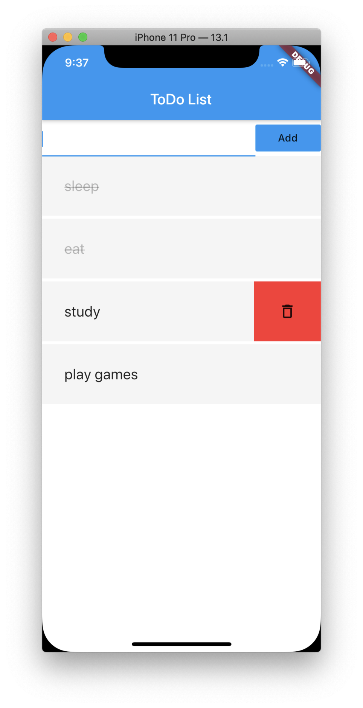

[返回目录](../../README.md)

# 初次使用Flutter，构建一个TodoList App
本文记录了初次使用Flutter开发App中遇到的一些问题与解决方法。

完整App代码见[flutter_todo](https://github.com/Lskkkk/flutter_todo)。


## 环境搭建
按照[官方教程](https://flutter.cn/docs/get-started/install)搭建环境，很简单。

## 构建组件
Flutter的设计哲学与React Native类似，即认为UI=f(data)；在Flutter中，所有的组件都是Widget，通过Widget嵌套与组合即可得到界面。

在设计组件时，也有StatefulWidget与StatelessWidget之分；类似的，在状态管理时，也可采取类似Redux的框架来管理数据。

在构建Todo App时，设计了一个container组件用于管理数据与渲染各个Item；
Item组件渲染每个Todo Item，并维持自身的一些状态，比如，滑动展示删除按钮等等。

在Flutter中，每个Widget都是使用类实现，几乎所有组件都需要依赖child属性，组件就是通过一层一层的嵌套进行布局，比如：
````
Container(
    color: Colors.white,
    child: Column(
        children: <Widget>[
        Input(add),
        Expanded(
            child: ListView.builder(
                itemCount: list.length,
                itemBuilder: (BuildContext context, int index) {
                return Item(
                    ValueKey(list[index].content +
                        list[index].isSelected.toString()),
                    list[index].content,
                    list[index].isSelected,
                    this.toggle,
                    this.delete);
                },
                shrinkWrap: true),
        ),
        ],
    ))
````

这样与React中createElement的方式类似，这样的写法会显得臃肿，由此可见，React引入JSX语法是多么一个伟大的决定。

需要特别注意的一些点：
1. 删除按钮是absolute展示的，需要使用Stack和Positioned设置浮动状态；
2. 样式上Flutter更接近于Native上的概念，需要使用各种布局如Row、Column等等；

## Store与数据持久化
由于Flutter组件化的特性，在构建App时，构建了一个Store去管理所有Item的数据，该Store保存在顶层StatefulWidget中。

常规的数据结构这里不谈，需要注意的是如何处理数据持久化？

一般的数据持久化方法有[三种](https://flutter.cn/docs/cookbook#persistence)，考虑到数据结构比较简单，这个App使用键值对，即shared_preferences即可。

````
// Store.dart
// 读取数据
Future<bool> _read() async {
    final prefs = await SharedPreferences.getInstance();
    final List<String> storeData = prefs.getStringList(this.saveKey);
    this.list = [];
    storeData.forEach((data) {
        final item = StoreItem.toItem(data);
        if (item != null) {
        this.add(item);
        }
    });
    return true;
}

// 存储数据
_write() async {
    final prefs = await SharedPreferences.getInstance();
    prefs.setStringList(this.saveKey, this._serialize());
}
````

在每次Item状态改变时调用_write方法，在顶层Widget初始化时调用_read方法读取数据。
````
class _Home extends State<Home> {
    ToDoStore store = ToDoStore();

    @override
    void initState() {
        super.initState();
        this._load();  // 初始化state时load数据
    }
    ...
}
````

## 手势操作
在每个Item上，设计了两种交互模式：
- 向左滑动，呼出删除按钮，点击删除；
- 单击Item，切换Item状态；
  
监控用户的手势，需要使用GestureDetector包裹需要监控的组件，并设置对应的钩子函数。

### 水平手势
监控水平方向上的滑动，使用：
- onHorizontalDragUpdate：滑动过程中一直触发；
- onHorizontalDragEnd：滑动接受后触发；

结合这两个时机，在Update时不断累加用户滑动的distance，并且根据这个distance去控制删除按钮的露出宽度；在End后，控制删除按钮完整显示或隐藏。
````
onHorizontalDragUpdate: (DragUpdateDetails details) {
    final dx = details.delta.dx;
    if (dx < 0) {
        onScrollingLeft(dx);
    } else {
        onScrollingRight(dx);
    }
},
...
onScrollingLeft(dx) {
    if (distance == 0) return;
    if (distance < 0) {
        setState(() {
            distance = 0;
        });
    } else {
        setState(() {
            distance = (distance + dx) < 20 ? 0 : distance + dx;
        });
    }
}
````
删除按钮本身使用absolute布局，初始时处于隐藏状态，随着用户滑动distance的改动，露出相应大小的内容。

与RN类似，Flutter也支持Transform，且使用起来较为方便：
````
Transform.translate(
    offset: Offset(distance, 0),
    child: IconButton(
        icon: Icon(Icons.delete_outline),
        onPressed: () {
            this.delete(this.content);
        }),
    )
)
````

### 单击手势
使用onTapUp监控用户点击后手指抬起的时机进行处理。
````
onTapUp: (TapUpDetails details) {
    this.toggle(this.content);
}
````

## 问题
### 问题一：列表刷新问题
在Flutter中也遇到了列表刷新的问题，与RN上类似，可能Flutter中在处理列表时，也只进行了一层浅比较，每个Item对应的数据对象指向的一样时，即使对象的属性变化了，界面仍然也不会发生变化。

通过为每个Item设置Key即可解决这个问题，当Key一样时，不更新界面，Key不同时则更新；因此，可设置
````
ListView.builder(
    itemCount: list.length,
    itemBuilder: (BuildContext context, int index) {
    return Item(
        // key有两个作用：1. 根据key去标识一个组件实例是否需要更新状态。2. key相同时即使数据不同，界面不会刷新。
        ValueKey(list[index].content +
            list[index].isSelected.toString()),
        list[index].content,
        list[index].isSelected,
        this.toggle,
        this.delete);
    },
    shrinkWrap: true
)
````
设置Key时需要注意Key要从可能会变化的属性去生成，这样就能及时更新界面。

## 总结
- Flutter与React Native设计思想类似，即认为UI只是数据的表现形式，因此组件化的思想也可以通用；
- Flutter中也分为状态组件和展示组件两种；
- Flutter中主要使用类去构建Widget，一层一层嵌套形成整个布局；与JSX语法相比有点繁琐；