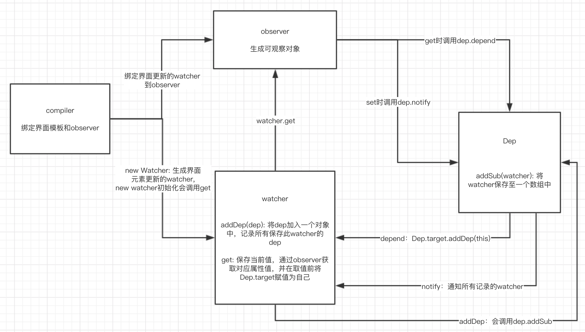

[返回目录](../../README.md)

# Vue中的双向绑定MVVM原理解析
本文是简单地剖析Vue中MVVM原理，主要分析和实现了数据挟持和发布订阅的流程。在部分地方，如compiler绑定observer和html模板的地方做了省略替代实现；在数据挟持、发布订阅的流程上，尽量与Vue保持一致。

众所周知，Vue中的MVVM实现主要使用了数据挟持和发布订阅。

在Vue3之前，数据挟持主要由Object.defineProperty实现；Vue3之后，在兼容ES6的环境中，使用Proxy实现，其他不兼容的场景继续使用原方式；

使用Proxy解决了之前无法解决的问题，如新增属性无法挟持，数据元素或长度变换无法监听。

而在View-Model改变导致View改变的过程中，使用了发布订阅模式，使得界面局部刷新。

接下来就针对这一过程进行分析及模拟实现。

## MVVM双向绑定的原理
- View变化导致View-Model变化：

    View-Model生成和View对应的事件方法，MVVM自动绑定这些事件方法到View，用户操作View即调用这些方法修改数据；
- View-Model变化导致View变化：

    View-Model维护了一些使得View update的订阅者，当View-Model中的属性值发生改变时，会通知订阅者进行update;

所有，双向绑定的核心就在于，View-Model如何自动地获取订阅者并通知订阅者的过程。前一个也被成为依赖收集。

一般地，会在observer对象中，在属性的get中设置依赖收集，在属性的set中则通知订阅者更新。接下来重点分析这个过程。

## 模块组成
MVVM主要包含以下几个模块，分别是：
- compiler：绑定view-model和view；
- observer：将普通Object生成数据挟持后的对象；
- dep：记录保存订阅者；
- watcher：订阅者，一般是包含界面update的任务的对象；

## 流程

### 依赖收集流程
1. MVVM入口对data生成observer对象；
2. compiler将observer对象绑定到html，对每个使用的属性设置watcher监听改变(new watcher)；
3. watcher在初始化时，会调用watcher.get方法，将自己保存到全局，并触发observer对应属性的get；
4. observer属性的get中，会将全局的watcher添加至自身的订阅者列表中；
以上就完成了依赖收集的过程。

### 更新流程
1. 外部事件或用户行为导致observer的属性值被修改；
2. 在对应属性的set触发且值发生改变时会通知收集到的订阅者，触发每一个订阅者的update方法；

## 代码实现
参考[github](https://github.com/Lskkkk/Demo/tree/master/mvvm/src/mvvm)，已有注释，结合上述流程观看。

## 参考
- [剖析Vue实现原理 - 如何实现双向绑定mvvm](https://github.com/DMQ/mvvm)